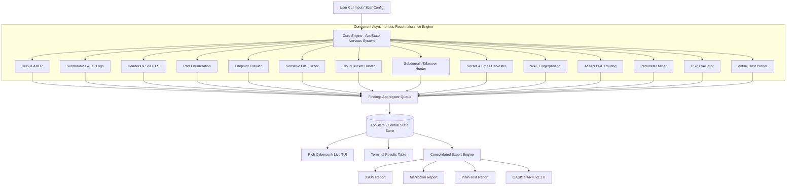

<p align="center">
  <pre align="center">
  ██████╗ ███████╗ ██████╗ ██████╗ ███╗   ██╗     ██╗    ██╗██╗██████╗ ███████╗
  ██╔══██╗██╔════╝██╔════╝██╔═══██╗████╗  ██║     ██║    ██║██║██╔══██╗██╔════╝
  ██████╔╝█████╗  ██║     ██║   ██║██╔██╗ ██║     ██║ █╗ ██║██║██████╔╝█████╗  
  ██╔══██╗██╔══╝  ██║     ██║   ██║██║╚██╗██║     ██║███╗██║██║██╔══██╗██╔══╝  
  ██║  ██║███████╗╚██████╗╚██████╔╝██║ ╚████║     ╚███╔███╔╝██║██║  ██║███████╗
  ╚═╝  ╚═╝╚══════╝ ╚═════╝ ╚═════╝ ╚═╝  ╚═══╝      ╚══╝╚══╝ ╚═╝╚═╝  ╚═╝╚══════╝
  </pre>
  <p align="center">
    <strong>The Next-Generation Cyber-Reconnaissance & Attack Surface Intelligence Engine</strong>
  </p>
  <p align="center">
    <a href="https://github.com/0xK3rnelX/recon-wire/actions"></a>
    <a href="https://www.python.org/"></a>
    <a href="LICENSE"></a>
    <a href="https://github.com/0xK3rnelX/recon-wire"></a>
    <a href="https://github.com/astral-sh/ruff"></a>
    <a href="https://hub.docker.com/"></a>
  </p>
</p>

---

## ⚡ Overview

**RECON-WIRE** is an asynchronous, high-velocity reconnaissance and external attack surface management (EASM) framework engineered for red teams, penetration testers, and bug bounty hunters. 

Unlike legacy single-threaded tools that execute disjointed scripts, RECON-WIRE orchestrates **17 concurrent intelligence modules** through a single-threaded asynchronous nervous system. It continuously correlates findings in real time, streams telemetry through a responsive terminal user interface (TUI), and exports enterprise-grade reports in JSON, Markdown, plain text, and native GitHub **OASIS SARIF v2.1.0** format.

---

## 🚀 Key Features

- **⚡ Fully Asynchronous Core:** Built on top of Python's `asyncio` event loop and `httpx` connection multiplexing to query hundreds of endpoints with sub-second latency.
- **🖥️ Cyberpunk Live Terminal Dashboard:** High-contrast TUI with live vector activity, discovery feeds, response telemetry, and system health status.
- **🛡️ Adaptive Stealth & Evasion Engine:** Jittered request intervals, rate limiting, and authentic User-Agent rotation to bypass heuristic rate-limiters.
- **🎯 Zero Placeholders / Production-Grade:** Includes curated signature databases for cloud providers, WAF fingerprints, exposed secrets, and parameter mining.
- **📊 Unified Multi-Format Exporters:** Export findings in structured JSON, audit-ready Markdown, compact text, or GitHub Security SARIF v2.1.0.

---

## 🔬 Reconnaissance Modules Matrix

| Module | Identifier | Description | Detection Vectors / Capabilities |
| :--- | :--- | :--- | :--- |
| **DNS Intelligence** | `DNS` | Full DNS record enumeration & GeoIP | A, AAAA, MX, TXT, NS, CNAME, SOA, CAA, AXFR Zone Transfer |
| **Subdomain Discovery** | `SUBDOMAINS` | Passive & active domain mapping | crt.sh CT logs, 350+ candidate brute-force, permutation engine |
| **Security Headers** | `HEADERS` | HTTP header security audit | CSP, HSTS, X-Frame-Options, CORS, Permissions-Policy, Grade A-F |
| **Tech Fingerprinting** | `TECH` | Web stack & framework identifier | Server headers, cookie heuristics, HTML body signatures, Wappalyzer |
| **WHOIS & Registration** | `WHOIS` | Domain metadata & ownership | Registrar, creation/expiry tracking, DNSSEC state, contact leaks |
| **TLS / SSL Audit** | `TLS` | Deep X.509 certificate audit | SANs, Cipher suites, Key length, Expiry days, CT log compliance |
| **Port Enumeration** | `PORTS` | High-speed TCP service scanner | 70+ top administration, DB, cloud, and proxy ports |
| **Endpoint Crawler** | `ENDPOINTS` | Shallow web surface spider | Form action mining, script tags, internal API links, anchors |
| **Fuzzing & Leaks** | `FUZZ` | Sensitive file disclosure scanner | 65+ critical paths: `.env`, `.git`, `.sql`, backups, actuator endpoints |
| **Cloud Bucket Hunter**| `CLOUD` | Public cloud storage detector | Unauthenticated bucket inspection across AWS S3, GCP, and Azure |
| **Subdomain Takeover** | `TAKEOVER` | Dangling CNAME takeover engine | 36+ verified cloud fingerprints (GitHub, AWS, Vercel, Netlify, etc.) |
| **Secret Harvester** | `HARVEST` | High-entropy credential scraper | 21+ regex engines for AWS, GitHub, Stripe, Slack, JWT, RSA keys |
| **WAF Fingerprinting** | `WAF` | Web Application Firewall detection | Dual passive header analysis & active non-destructive attack probes |
| **ASN & BGP Routing** | `ASN` | Autonomous System & IP routing | Public IP mapping, BGP prefix discovery, RIR & ISP mapping |
| **Parameter Mining** | `PARAMS` | Hidden query parameter discovery | 185+ parameters tested for reflection, status shifts & body diffs |
| **CSP Bypass Engine** | `CSP` | Content Security Policy evaluator | Evaluates 20+ JSONP gadget bypasses, unsafe-inline, script-src flaws |
| **Virtual Host Prober**| `VHOST` | Reverse host & vhost discovery | 205+ enterprise host headers tested with baseline diff heuristics |

---

## 📊 Comparison Against Industry Tools

| Feature | **RECON-WIRE** | Sublist3r | Amass | httpx | Nikto |
| :--- | :---: | :---: | :---: | :---: | :---: |
| **Asynchronous Engine** | **Yes (`asyncio`)** | No | Yes (Go) | Yes (Go) | No (Perl) |
| **Live TUI Interface** | **Yes (Rich)** | No | No | No | No |
| **Port & Service Scanner** | **Yes** | No | No | Yes | Yes |
| **Subdomain Takeover Hunter**| **Yes (36+ Signatures)**| No | Limited | No | No |
| **Secret & Credential Scraper**| **Yes (Entropy+Regex)**| No | No | No | No |
| **WAF Active/Passive Probe** | **Yes** | No | No | No | Limited |
| **Virtual Host Enumerator** | **Yes (Baseline diff)** | No | No | No | No |
| **CSP Gadget Bypass Audit** | **Yes** | No | No | No | No |
| **Native SARIF v2.1.0 Export**| **Yes** | No | No | No | No |

---

## 📦 Installation

### Option 1: Using pip / virtualenv (Recommended)

```bash
# Clone the repository
git clone https://github.com/0xK3rnelX/recon-wire.git
cd recon-wire

# Create and activate virtual environment
python -m venv .venv
source .venv/bin/activate  # On Windows: .venv\Scripts\activate

# Install dependencies and CLI package
pip install --upgrade pip
pip install -r requirements.txt
pip install -e .
```

### Option 2: Using Docker

```bash
# Build the production image
docker build -t recon-wire:latest .

# Run a scan inside container
docker run --rm -it -v $(pwd)/output:/app/output recon-wire:latest example.com --json /app/output/report.json
```

### Option 3: Using Docker Compose

```bash
docker compose run --rm recon-wire example.com --markdown /app/output/report.md
```

---

## 🛠️ Usage & CLI Reference

```text
usage: recon-wire [-h] [--timeout TIMEOUT] [--subdomains SUBDOMAINS]
                  [--no-geoip] [--no-axfr] [--output-dir OUTPUT_DIR]
                  [--rate MAX_CONCURRENT] [--json [FILE]] [--markdown [FILE]]
                  [--text [FILE]] [--sarif [FILE]] [--delay DELAY]
                  [--jitter JITTER] [--user-agent USER_AGENT] [--no-ports]
                  [--no-endpoints] [--no-fuzz] [--no-cloud] [--no-takeover]
                  [--no-harvest] [--no-waf] [--no-asn] [--no-params]
                  [--no-csp] [--no-vhost]
                  url
```

### Common Command Examples

```bash
# Standard fast reconnaissance scan
recon-wire example.com

# Comprehensive scan with multi-format exports
recon-wire https://target.corp --json scan.json --markdown report.md --sarif security.sarif

# Stealth engagement with custom User-Agent and random delay jitter
recon-wire target.com --delay 0.5 --jitter 1.5 --user-agent "Mozilla/5.0 (Windows NT 10.0; Win64; x64)"

# Target specific modules (disable fuzzing and ports)
recon-wire target.com --no-fuzz --no-ports --timeout 4
```

### CLI Arguments & Flags

| Flag | Argument | Description | Default |
| :--- | :--- | :--- | :--- |
| `url` | `string` | Target domain or URL to inspect | *Required* |
| `--timeout` | `int` | Network timeout in seconds per request | `5` |
| `--subdomains` | `int` | Maximum subdomains to probe | `200` |
| `--rate` | `int` | Maximum concurrent asynchronous connections | `20` |
| `--delay` | `float` | Fixed pause in seconds between HTTP requests | `0.0` |
| `--jitter` | `float` | Random jitter upper bound in seconds (0.0 to N) | `0.0` |
| `--user-agent`| `string`| Custom User-Agent string or `random` for pool | *Default* |
| `--json` | `[FILE]` | Export results to structured JSON report | *None* |
| `--markdown` | `[FILE]` | Export audit results to formatted Markdown report| *None* |
| `--text` | `[FILE]` | Export results to clean plain-text report | *None* |
| `--sarif` | `[FILE]` | Export findings to OASIS SARIF v2.1.0 standard | *None* |
| `--no-ports` | *None* | Disable TCP port scanning | `Enabled` |
| `--no-fuzz` | *None* | Disable sensitive path fuzzing | `Enabled` |
| `--no-cloud` | *None* | Disable public cloud bucket hunter | `Enabled` |
| `--no-takeover`| *None* | Disable subdomain takeover hunting | `Enabled` |
| `--no-harvest`| *None* | Disable email & API credential scraping | `Enabled` |
| `--no-waf` | *None* | Disable WAF fingerprinting | `Enabled` |
| `--no-asn` | *None* | Disable IP range and BGP ASN mapping | `Enabled` |
| `--no-params` | *None* | Disable hidden query parameter discovery | `Enabled` |
| `--no-csp` | *None* | Disable Content Security Policy evaluation | `Enabled` |
| `--no-vhost` | *None* | Disable virtual host brute forcing | `Enabled` |

---

## 🔒 GitHub Actions CI/CD Integration

Export results directly into GitHub's **Code Scanning & Security** alerts tab using native SARIF export:

```yaml
name: Security Reconnaissance Scan

on:
  schedule:
    - cron: '0 0 * * 1' # Weekly security sweep
  workflow_dispatch:

jobs:
  recon:
    name: Attack Surface Scan
    runs-on: ubuntu-latest
    permissions:
      security-events: write

    steps:
      - name: Checkout Code
        uses: actions/checkout@v4

      - name: Setup Python
        uses: actions/setup-python@v5
        with:
          python-version: "3.12"

      - name: Install RECON-WIRE
        run: pip install .

      - name: Execute Scan with SARIF Output
        run: |
          recon-wire https://example.com --sarif results.sarif

      - name: Upload SARIF to GitHub Security Tab
        uses: github/codeql-action/upload-sarif@v3
        if: always()
        with:
          sarif_file: results.sarif
```

---

## 🧱 Architecture



---

## 🤝 Contributing

Contributions are welcomed! Check out our [Contributing Guide](CONTRIBUTING.md) and [Code of Conduct](CODE_OF_CONDUCT.md).

1. Fork the repo (`https://github.com/0xK3rnelX/recon-wire`)
2. Create your feature branch (`git checkout -b feature/new-module`)
3. Commit your changes (`git commit -m 'Add new attack vector'`)
4. Push to the branch (`git push origin feature/new-module`)
5. Open a Pull Request

---

## ⚖️ Legal & Ethical Disclaimer

> [!CAUTION]
> **RECON-WIRE** is developed strictly for educational, defensive, and authorized penetration testing operations. Scanning targets without prior explicit written permission is strictly prohibited. The developers assume no liability for misuse, unintended damage, or illegal activities conducted with this tool.

---

## 📄 License

Distributed under the **MIT License**. See [`LICENSE`](LICENSE) for details.
